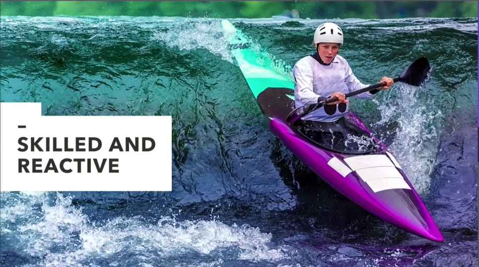
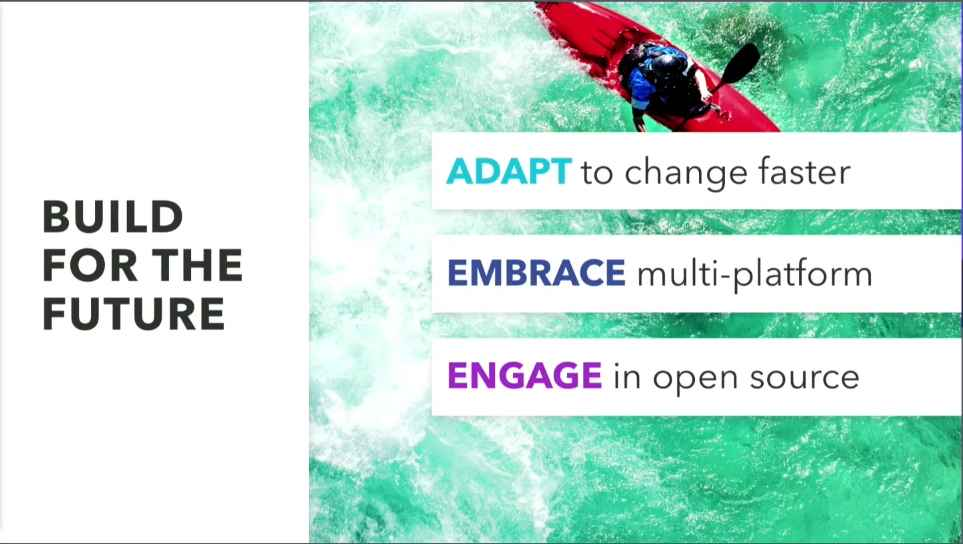

## Digital Transformation
- by Abby Kearns, CEO of Cloud Foundary
  - https://www.youtube.com/watch?v=bDGndiwez8U
- Catepilla vs Whitewater Kayaker
  - Magic, spins a cocoon disappears for a few weeks and emerges later transformed to a butterfly.
  - 
  - Skilled & Reactive to the waters around her constantly shifting changing.
  - 
  - Are you able to be responsive to customer needs, the changes that are happening in your markets, industry ? 
  - Are you able to innovate and iterate at the pace you want to?
  - Everything is accelating. 
  - It's not that simple real transformation is not about adopting the latest technology, but it's about adapting to a world that's now ordered around technology.
- Core tenanats of digital fransforamation
  - 
    

# Keywords
## Modernization 
 - Serverless & Containerization 

## Obserability
 - Metrix
 - Trace
 - Logging

# 요소기술
## Serverless
## Kubernetes (EKS)
## App Mesh
## CICD
### Infrastructure As a Code

# Workshop
## EKS
## App Mesh
## Code Series